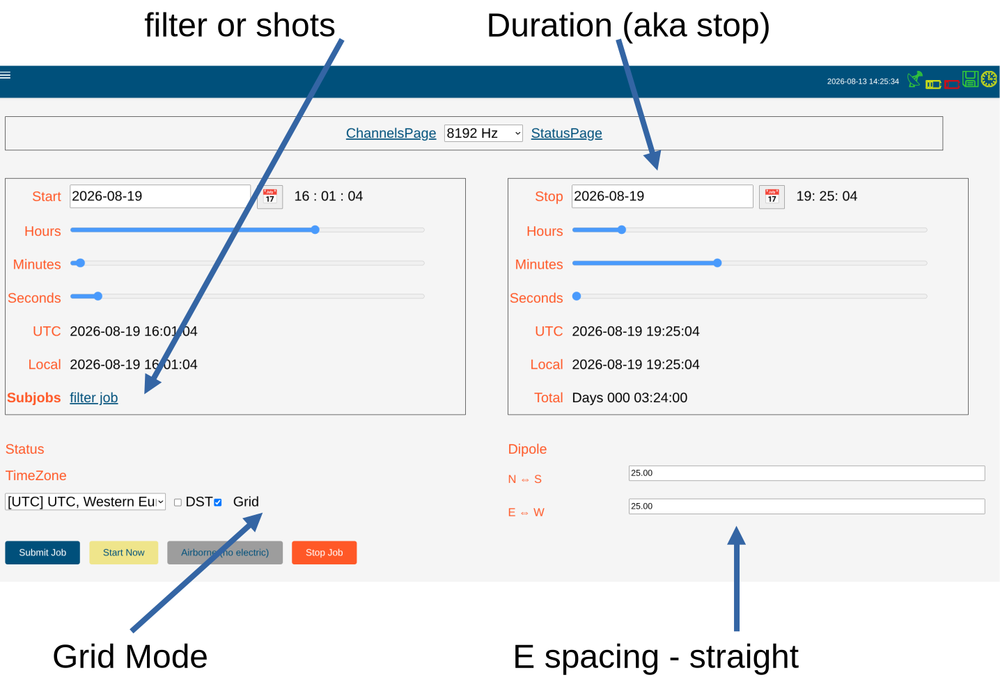

You can not create a job in the past.<br>
When the job page is accessed, the start date and time is updated to the current date and time **once**. <br>
The stop date and time is stored as *duration* in the database. <br>
$prep_time = 30s is added to the start date and time in case the start date and time is too "early". <br>
So finally a job shall start regardless if you press **submit** or **start now**. <br>
While the selftest is active, you can't submit a job. <br>

{width="90%"}

## Creating a Job

### **First, select the sampling rate.**<br>

* Rates marked with *(fil)* are virtual low sampling rates, nothing to do further on, start a job.
* Rates not marked, can be used for additional filtering ***or*** for shots.
  * additional filtering: record with 4 kHz and 128 Hz. <br>
  the 128 Hz you may want for remote download, the 4 kHz you download later.
  * shots: record with 2 kHz and 32 kHz overnight. <br>
    * get your continuous LF data with 2 kHz, later filter
    * get your shot every 15 minutes with 32 kHz, later filter 4x. <br>
    From the shot data you select shots with good AMT activity. <br>
    You get a smooth sounding from 10 kHz down to 100 or 1000s - depending on how long you recorded.

```{mermaid}
flowchart LR
  A["straight 132k, 65k<br>30 min"]
  B["filter 4x, 4x"]
  C["interpretation"]
  D["32 Hz (fil)"]
  E["LF<br>8 kHz<br>256 Hz sub "]
  F["remote download<br>256 Hz"]
  G["HF<br>4 kHz<br>64k shots"]

  A --> B
  B --> C
  D --> B
  G --> B
  E --> F
  E --> B
```

We cover the following cases as displayed above:

* AMT, 2 km, high sampling rate only
* Fluxgate deep, 100 km, low sampling rate only
* typical overnight, 5 km, medium sampling rate plus shots
* deep with remote download / monitoring, 30 km, medium sampling rate plus filter

### Start and Stop Date and Time

Internally start day and time and duration is stored (finally the system counts the second pulses from the GPS until stop).

For start time:

* Select from the date icon the day
* slide the start hour
* slide the minute
* slide the second


::: {.callout-tip}
If Grid mode is checked, sliders will "jump" into start time **64 seconds grid**.<br>
This allows you always to make remote reference, regardless of the sampling rate.
:::

Then for stop time:

* Select from the date icon the day
* slide the stop hour
* slide the minute
* slide the second


::: {.callout-tip}
# Change start
If you later decide to change the start time, stop time will shift accordingly.
:::

### E spacing

::: {.callout-important}
# Rotation
Do not even dream of using others setups. Only N&rarr;S and E&rarr;W are allowed here.<br>
Troublemakers are not.
:::

Supply the dipole length.

::: {.callout-caution}
# Timeout
After 0.9 seconds the form is saved. You must be faster and type each digit in less than 0.9 seconds. <br>
... age control &#128522;
:::

### TimeZone

 Select a timezone for your work, additionally you can check "DST" (daylight saving time, aka summer time). <br>
 Hence that in the job tables, file names and others **always UTC** is used.<br>
 If DST is checked, the "start time" is shifted by 1 hour earlier, BUT the stop time is not correct when DST changes during recording[^dstnote]. <br>

### atss

To change between new atss and old ats, go to the channels page and toggle the atss button. <br>
It will be stored in the hardware table and used for this and next jobs. <br>


## Submitting a Job

Ref. also to the [program logic](../flows/jobs_flow.qmd)

If the programmed time (including preparation time) has passed by, the job is simply shifted to the next possible start time. <br>


## Special Jobs

* Sensor Detection: fast, takes 10 s
* auto gain / auto offset: long, takes ~ 3 min. Needs enough time to acquire a reliable estimate
* contact resistance: medium, takes ~ 1 1/2 min. AC currents are fed into the electrodes to measure the contact resistance.
  

[^dstnote]: DST = Daylight Saving Time, 1 hour+ sometimes 2 hours+ is today a troublemaker. No energy is saved, timetables of airlines and trains are mixed up. Some countries stopped DST. 84% of the Europeans 2018 voted against DST.