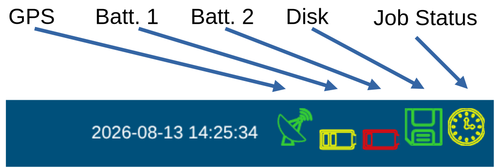

## Status Bar

The actual GPS time is updated every two seconds from the database, and there it is cycled every few seconds from the GPS. So the time lacks always *behind*, up to 4 seconds (this is not meant to be a real-time display). 

## GPS {width=10%}

Turns [green]{style="color:green;"} when the GPS is locked, and [red]{style="color:red;"} when the GPS is not locked. 
Hence that the ADU does **not adjust the time while recording**. It makes sense to wait for lock. Especially for long jobs or remote reference do not start when the symbol is red!

## Battery {width=10%}

|Status | Color / Voltage |
|---|---|
| green: 100% battery voltage is | above 12.8 V  [green]{style="color:green;"} {width=10%} |
| green: 75% battery voltage is | above 12.2 V  [green]{style="color:green;"} {width=10%} |
| yellow: 50% battery voltage is | above 11.8 V  [yellow]{style="color:orange;"} {width=10%} |
| red: 20% battery voltage is | below 11.8 V  [red]{style="color:red;"} {width=10%} |

You can set the shutdown voltage in the configuration file. 
**LiIon** batteries can have their own voltage controller and **suddenly switch off at 12V**. 
`echo "12.0" > /mtdata/mcp_sys/ExtraShutdownVoltage.txt`  
as root user, changes the shutdown voltage to 12.0 V for example.

### Disk {width=6%}

|Free Space | Color  |
|---|---|
| > 40 GB free | [green]{style="color:green;"} |
| > 20 GB free | [yellow]{style="color:#edda74;"} |
| < 20 GB free | [red]{style="color:red;"} |

### Timer

| Timer status | Symbol |
|---|---|
| Idle | { width=10%} |
| Waiting | { width=10%} |
| Recording | { width=10%} |